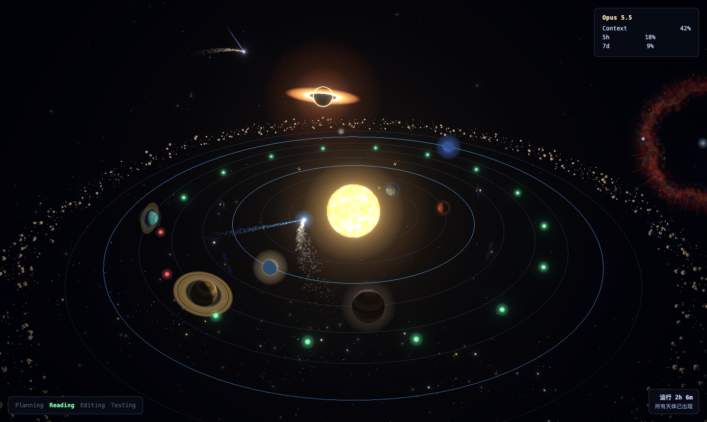
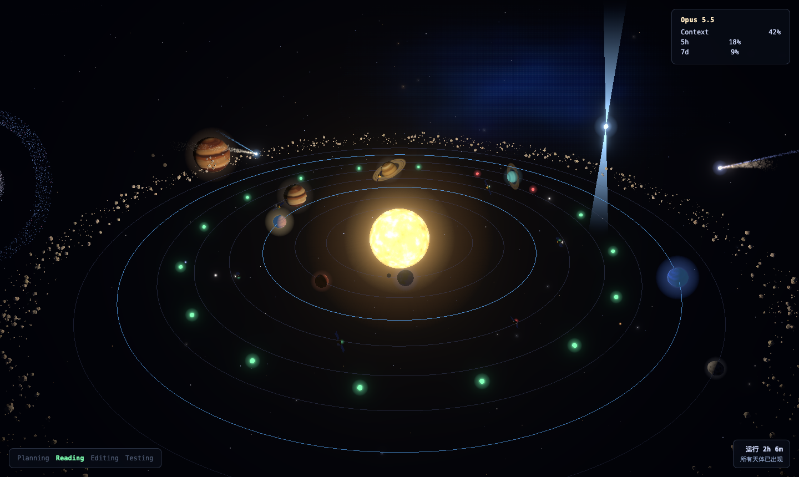

<div align="center">

# 🛰️ Orbit

### Deep-Space-Coding-Observatory

**Watch Claude Code work, rendered as a living solar system.**

*Every file it reads becomes a satellite. Every command launches a rocket.<br>
The longer it works, the more of the universe opens up: from Earth to a black hole.*


**English** · [简体中文](README.zh-CN.md)

[Quick start](#-quick-start) · [The sky guide](#-the-sky-guide) · [How it works](#%EF%B8%8F-how-it-works) · [Development](#%EF%B8%8F-development)

</div>

---



Orbit wraps the `claude` CLI and turns the session into a real-time 3D
deep-space dashboard in your browser. You can tell at a glance what Claude is
doing, whether it's still working or needs you, and how long it has been going.

- 🔭 **See it think.** Reads, edits, searches, shell commands and test runs each get their own visual.
- 🚨 **Know when it needs you.** The sun turns red, warning rings pulse and the tab title blinks.
- 🌌 **Rewards that grow.** Working time unlocks planets, then deep-space wonders, up to a supernova remnant at two hours.
- 🔒 **Leaves no trace.** Hooks are injected per session through `--settings`. Your Claude Code config is never touched, and everything stays on `127.0.0.1`.

---

## 🚀 Quick start

```bash
npm install          # install the dashboard's build tooling
npm run build        # bundle the 3D dashboard into web/dist
npm link             # put `orbit` on your PATH

orbit claude         # …or any claude arguments: orbit claude --resume
```

Orbit picks a free port (default `4321`), starts a local server, opens a
browser tab, and runs `claude` with your arguments passed through untouched.

> [!TIP]
> Don't want to install? Run `node bin/orbit claude [args]` straight from the repo.

**Requirements:** Node.js ≥ 20 and `claude` (Claude Code) on your `PATH`.

---

## 🌠 The sky guide

Everything on screen comes from a real signal in your session. Here's how to
read it.

### ☀️ The central star shows Claude's mode

| Star | Mode | Meaning |
|---|---|---|
| 🔆 Blazing, boiling sun; camera slowly orbits | **Active** | Claude is working |
| 🔴 Dim red star, expanding amber warning rings, violet nebula drifting in | **Waiting** | Claude needs your input (the banner shows its message and the tab title blinks `⚠ 需要你的输入`) |
| 🟤 Burnt-out ember; planets glide to a halt | **Idle** | No task running (`IDLE · 等待新任务`) |
| ✨ Bright flare + **MISSION COMPLETE** | Just finished | Claude ended its turn |

### 🛰️ Live activity: every tool call has a visual

| You see | Triggered by |
|---|---|
| 🛰️ **Satellite** (gold bus, solar wings, dish) | `Read` / `Edit` / `Write` on a file. The beacon flashes red when the same file is touched again. Up to 12 are kept, and the oldest drops off. |
| 🚀 **Gold rocket** spiraling outward | `Bash` command |
| 🚀 **Green rocket** | `Bash` command that looks like tests (`test`, `jest`, `pytest`, `vitest`, `rspec`, `go test`) |
| 🟢🔴 **Test ring** of green/red beads | Pass/fail counts parsed from the test output |
| 📡 **Radar ping** rippling out | `Grep` / `Glob` search |
| ☄️ **Comets** on eccentric Kepler orbits | Always there: ambient scenery |

### 🪐 Planets: the solar system lights up as Claude works

A planet lights up for each stretch of **active working time** and stays for
the rest of the session. Time spent waiting on you doesn't count. Time a
background subagent spends working does.

| Working time | Planet |
|---:|---|
| 0 min | 🌍 Earth |
| 2 min | 🔴 Mars |
| 4 min | 🟡 Venus |
| 6 min | 🟠 Jupiter |
| 9 min | 🪐 Saturn |
| 12 min | 🩵 Uranus |
| 16 min | 🔵 Neptune |
| 20 min | 🌙 The Moon |

> [!NOTE]
> **Subagents boost planets.** Each running subagent (`Agent` / `Task`) takes
> over one lit planet: it speeds up, and its orbit track and atmosphere glow
> brighter. The pick comes from a hash of the subagent's id, so it stays the
> same after a reload, and subagents running at the same time take different
> planets.

### 🌌 Deep-space wonders: rare sights for long sessions

When a new wonder unlocks, a toast announces it. Distant wonders are spread
around the sky, so the slowly turning camera brings them into view one at a
time.



| Working time | Wonder | What appears |
|---:|---|---|
| 5 min | ✨ **Open star cluster** · 疏散星团 | A young cluster of blue-white stars in a faint reflection nebula, like the Pleiades |
| 10 min | 🪨 **Asteroid belt** · 小行星带 | A ring of lumpy, tumbling rocks |
| 20 min | 🟠 **Distant gas giant** · 远方巨行星 | A far-out Jupiter-class world with four Galilean moons |
| 40 min | 🌀 **Spiral galaxy** · 旋涡星系 | Two-armed spiral, warm core, blue star-forming arms |
| 60 min | 💫 **Pulsar** · 脉冲星 | A spinning neutron star sweeping lighthouse beams across the sky |
| 90 min | 🕳️ **Black hole** · 黑洞 | Accretion disk from white-hot to deep red, inner streaks moving faster |
| 120 min | 💥 **Supernova remnant** · 超新星遗迹 | An expanding filament shell around a flickering neutron star |

The **Uptime HUD** (bottom-right) shows total working time. The **Status HUD**
(top-right) shows the model, context usage and rate limits. The **Step list**
(bottom-left) shows what Claude is doing right now.

---

## ⚙️ How it works

```text
   claude (child process)
        │  hooks + statusLine, injected via an inline --settings JSON
        ▼
   orbit-notify / orbit-statusline
        │  read the hook's stdin JSON → map it to an Orbit event
        ▼
   local HTTP server  ── POST /event ──▶  in-memory state
        │                                       │
        └──────────────  GET /events  ◀─────────┘
                     (Server-Sent Events)
                              │
                              ▼
         React Three Fiber dashboard (web/dist, served at GET /)
```

| Claude Code hook | Orbit event |
|---|---|
| `UserPromptSubmit` | `mission_start` |
| `PreToolUse` `Read` · `Edit`/`Write` · `Grep`/`Glob` · `Bash` | `file_read` · `file_edit` · `search` · `run_command` / `run_tests` |
| `PreToolUse` / `PostToolUse` `Agent`/`Task` | `agent_start` / `agent_end` |
| `PostToolUse` test command | `test_result` |
| `Notification` | `waiting` |
| `Stop` | `mission_complete` |
| `statusLine` | `status_update` (model, context %, rate limits) |

New browser tabs first receive a snapshot, so reloading keeps the current
state. The hook wiring exists only for the lifetime of one `orbit` process.

---

## 🛠️ Development

```bash
npm test                          # backend: node:test, zero runtime deps
npm test --workspace=web          # frontend: vitest + jsdom
npm run build                     # bundle the dashboard into web/dist
```

**Live-reload the dashboard:** run `npm run dev --workspace=web` in one
terminal and `orbit claude` in another. The Vite dev server proxies `/events`
and `/event` to the running backend on `:4321`.

Without a build, `GET /` falls back to a plain-text placeholder. The backend
and its tests never need the frontend to be built.

Set `ORBIT_DEBUG_LOG=<file>` to log every raw hook payload, which helps when
you're mapping a new tool.

```text
bin/         orbit · orbit-notify · orbit-statusline
src/         server, state, hook & statusline mappers (Node built-ins only)
web/src/
  state/     reducer, SSE client, planet & milestone rules
  scene/     star, planets, satellites, ships, nebula, comets, wonders/
  hud/       status, steps, mode banner, uptime, milestone toast
test/        backend tests        web/test/   frontend tests
```

---

## ⚠️ Known limitations

| | |
|---|---|
| **Status line** | `orbit` replaces your Claude Code `statusLine` for the session, so the terminal status bar goes blank while it runs. A future update will chain through to your own status line instead. |
| **Windows** | Developed and tested on macOS. Hook-command quoting and the browser-launch fallback haven't been verified on Windows yet. |

## 📚 Design docs

| Doc | What it covers |
|---|---|
| [`claude-observatory-design_1.md`](docs/superpowers/claude-observatory-design_1.md) | Original visual concept |
| [`2026-09-22-orbit-design.md`](docs/superpowers/specs/2026-09-22-orbit-design.md) | Full technical design |
| [`2026-09-22-orbit-frontend-design.md`](docs/superpowers/specs/2026-09-22-orbit-frontend-design.md) | 3D dashboard design |
| [`2026-09-22-orbit-event-pipeline.md`](docs/superpowers/plans/2026-09-22-orbit-event-pipeline.md) | Event pipeline implementation plan |
| [`2026-09-22-orbit-frontend-dashboard.md`](docs/superpowers/plans/2026-09-22-orbit-frontend-dashboard.md) | Dashboard implementation plan |

<div align="center">

<sub>🛰️ Built for people who like to watch the machine think.</sub>

</div>
